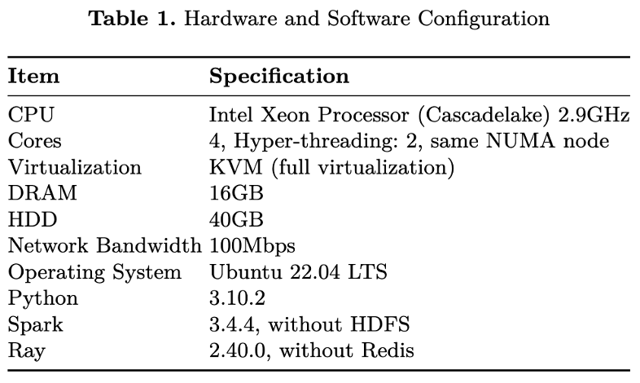
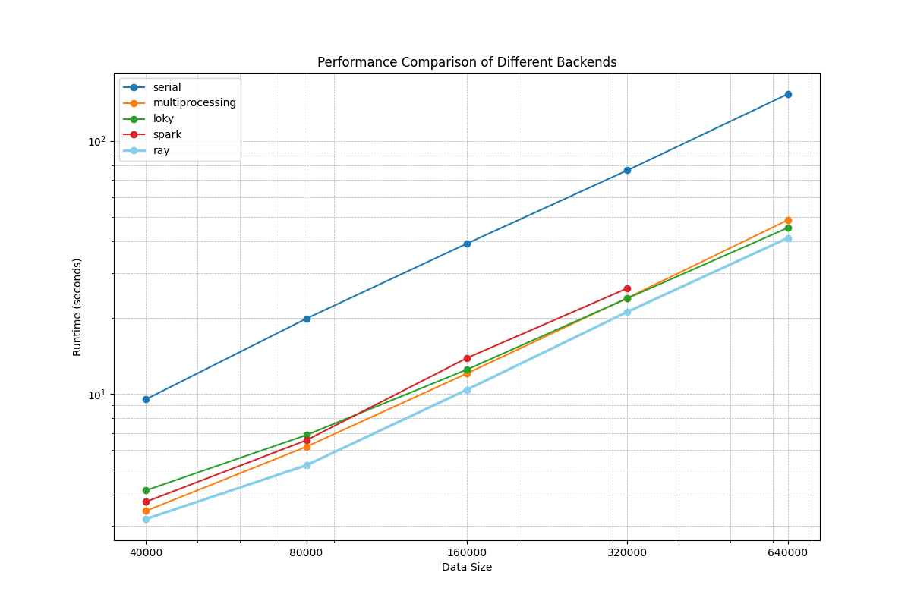
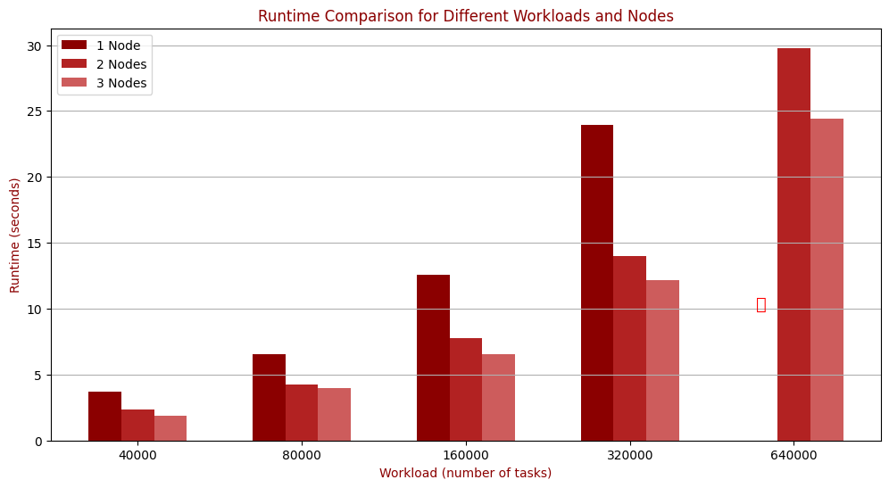
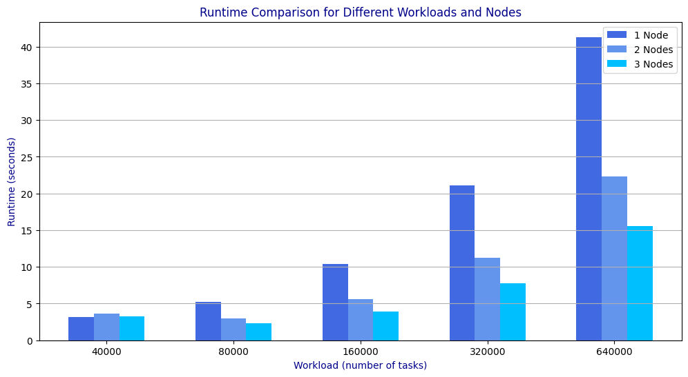
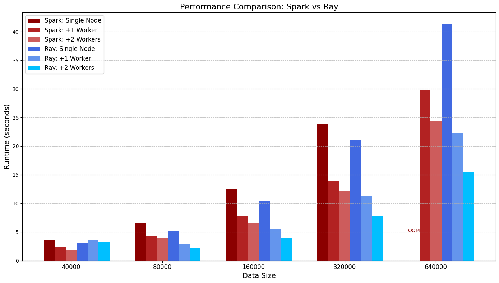
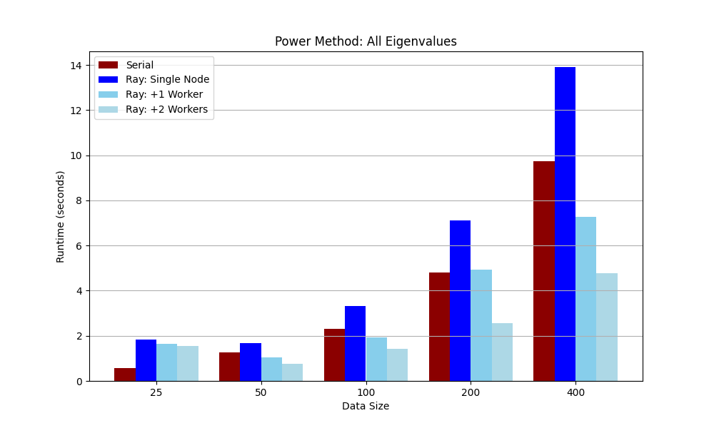
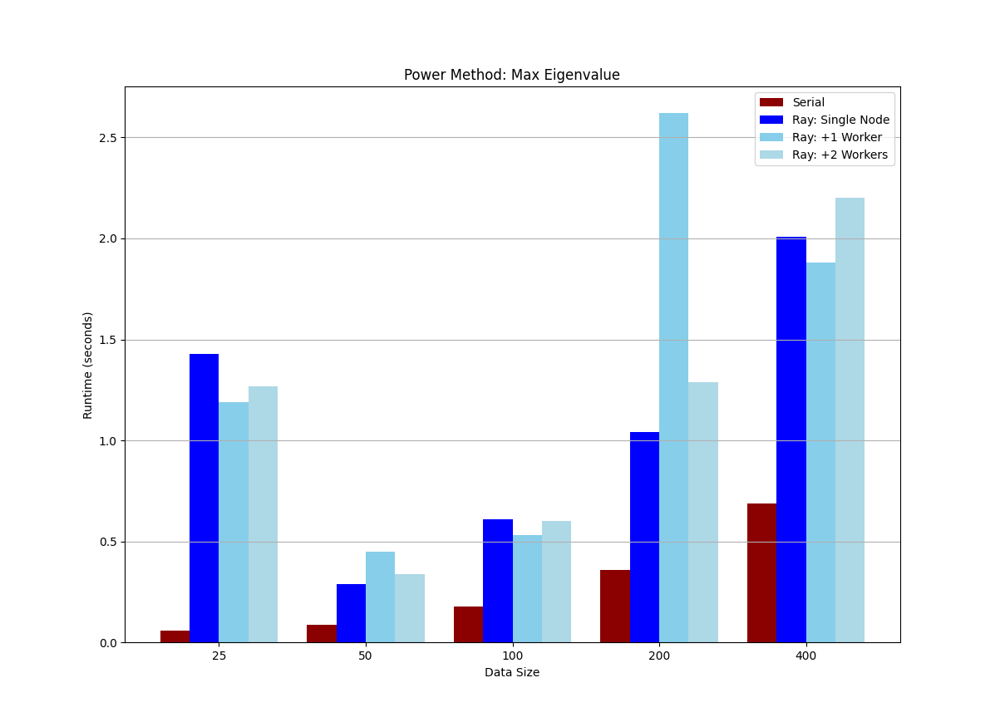
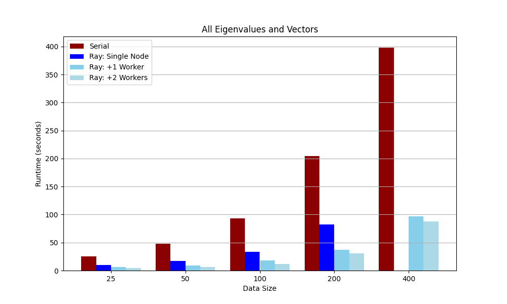

# Choosing-the-Right-Distributed-Systemat-the-Right-Time

[TOC]

## 研究目的

大数据技术在过去的二十年发展迅速，数据分析是其中最为旺盛的需求。以此需求催生出了各种计算模型以及系统来应对大规模数据的挑战，例如批处理系统、流式处理系统以及图处理系统。然而在最近两三年内，伴随着人工智能的爆发式发展，数据密集型软件本身也随之发生变化。数据密集型应用，例如用户偏好实时分析系统，广告实时推荐系统，从原来只需较为简单的数据操作，到现在需要利用越来越多复杂、需要反复迭代且对延迟敏感的人工智能算法。基于此，过去所流行的分布式系统可能面对当前的需求显得愈发乏力，因而针对不同特征的应用负载选择适合特定任务的分布式系统（数据处理系统）变得至关重要。本研究旨在比较不同分布式系统（如Spark和Ray）在特定任务（如文本批处理和矩阵特征值计算）中的性能，以指导在不同场景下的系统选择。

## 研究方法

为了评估分布式系统在不同任务场景中的性能表现，我们设计了一系列实验，使用 Apache Spark 和 Ray 两种主流分布式框架分别执行相同的任务，比较它们的性能差异。这些实验聚焦于任务的执行时间以及系统的扩展性，旨在探讨不同框架的适用性和优势。

Apache Spark 和 Ray 各自具有独特的特点，适用于不同的应用场景。Spark以其强大的批处理能力和对结构化数据的优异支持，广泛应用于大规模数据分析和传统机器学习任务。Ray 凭借其对低延迟、动态计算任务的支持，以及与 Python 的原生集成，在分布式机器学习、强化学习和实时推理领域表现出色。

根据实验需求，我们选用了以下框架，并分析了它们的核心特性。

### Apache Spark

Apache Spark 是一个通用的大数据处理引擎，设计用于高效的分布式计算。其核心特性包括：

- **大规模批处理：** 能够处理大规模批量数据，适合构建 ETL 流程和数据管道。
- **SQL 分析：** 提供 Spark SQL，用于查询和分析结构化数据。
- **传统机器学习：** 内置 MLlib，支持各种传统机器学习算法。
- **结构化流处理：** 支持低延迟的流式数据处理，适合中等实时性需求的场景。

这些特性使 Spark 成为大规模数据处理的理想选择，尤其在需要对大量结构化或半结构化数据进行分析时。

### Ray

Ray 是一个轻量级、通用的分布式框架，为机器学习（尤其是强化学习）和动态工作负载设计。其主要特性包括：

- **低延迟实时任务：** 支持快速的任务调度和执行，适合实时服务和动态计算。
- **分布式机器学习：** 提供 Ray Train 和 Ray Tune，支持大规模分布式训练和超参数调优。
- **强化学习：** 提供 RLlib，支持复杂环境中的大规模并行训练。
- **动态有状态计算：** 能够处理动态计算任务，适合状态频繁更新的应用场景。
- **Python 原生支持：** 提供直观的 API（如 `@ray.remote`），降低了开发分布式任务的难度。

Ray 的灵活性和易用性使其在处理实时性强、任务动态变化的场景中占据优势。

## 实验细节

### 实验设计

实验分为三种集群配置进行比较。单节点用于基准测试，评估单个节点在不同运行模式下的性能。一主一从和一主两从用于测试分布式环境的扩展性，比较集群节点增加对任务性能的影响。通过这三种配置，我们可以全面评估分布式系统在不同任务场景中的性能差异，并分析硬件资源的利用情况和扩展性表现。

1. **单节点（Single Node）：**使用单个节点运行，包括：
   1. 单进程运行：利用 Python 原生单进程执行。
   2. 多进程运行：基于 Python 的多进程机制（非多线程）。
   3. 分布式系统在单节点上的运行（Spark 和 Ray 单节点模式）。
2. **一主一从（1 Master 1 Worker）：**主节点既作为 Master 也作为 Worker，同时设置另一台节点作为 Worker。
3. **一主两从（1 Master 2 Worker）：**主节点既作为 Master 也作为 Worker，同时添加两个 Worker 节点进行任务执行。

### 实验环境

实验环境如表1所示。



### 代码结构

```bash
src
├── backends_benchmark-ray-distribute.py
└── backends_benchmark-spark-distribute.py
└── generate_matrix.py
└── ray_final.py
```


## 实验结果

### ApplyBatch

ApplyBatch在每个mini-batch上运行 Scikit-learn HashingVectorizer，并返回哈希特征的精简稀疏矩阵。

#### 整体实验结果



实验图表中，横轴（Data Size）表示输入数据的大小（任务规模），从 40,000 到 640,000 逐步增加。纵轴（Runtime）表示运行时间，单位为秒，采用对数刻度（Log Scale），以便清晰展示不同方法之间的性能差异。对比的五种方法为：

1. **Serial（单线程）：** 单个线程顺序处理任务，无并行优化。
2. **Multiprocessing（多进程）：** 使用 Python 的多进程模块，在单机环境下实现并行计算。
3. **Loky：** 一种轻量级并行后端，适合高效管理子进程，常用于 `joblib`。
4. **Spark：** Apache Spark 是一个分布式计算框架，擅长处理大规模批处理任务。
5. **Ray：** 通用分布式计算框架，特别适合动态任务和分布式机器学习。

**实验结果**：**Serial**随着数据规模的增加，运行时间迅速线性增长。单线程执行无并行优化，性能较差，适用于任务规模小或基准测试。**Multiprocessing**比单线程显著快，运行时间增长较慢。利用了多核 CPU 资源，但受限于单机硬件，扩展性有限。**Loky**性能与多进程类似，运行时间略低于 Multiprocessing。Loky 高效的进程管理使其在任务切换时稍具优势，但本质仍为单机并行。Spark在中小数据规模上性能与多进程接近，但在大数据规模下增长更快。**Spark** 的分布式任务调度在大规模数据处理上具有优势，但单机伪分布式模式下，开销较大，性能未充分发挥。**Ray**在所有数据规模上性能最优，运行时间始终低于其他方法。Ray 在任务拆分和调度上的轻量级架构使其具有高效的扩展性，非常适合计算密集型任务。

**实验结论：**在单节点环境下，Spark 的性能提升并不显著，与 Python 的多进程方法相比，优势不明显。在相同的集群配置下，Spark 更容易触发内存溢出（OOM）问题，特别是在处理大规模数据时。对于特定的工作负载，Spark 可能并非最佳选择，尤其是在需要低延迟或实时处理的任务中。这些结果表明，虽然 Spark 在大规模批处理和结构化数据分析中表现出色，但在某些情况下，其性能和资源管理可能存在局限性。相比之下，Ray 等框架在处理低延迟、实时工作负载以及分布式机器学习任务时，可能更具优势。因此，在选择分布式计算框架时，应根据具体的应用需求和工作负载特性，综合考虑各框架的特性和性能表现，以选择最适合的解决方案。

#### Spark可扩展性和内存管理能力



实验用来评估Spark在处理 ApplyBatch 工作负载时的性能表现，主要关注其扩展性（scalability）和内存管理能力。通过设计不同集群配置（1 节点、2 节点、3 节点）的实验，对任务规模从 40,000 到 640,000 的批处理任务进行测试，探索 Spark 在有限资源条件下的适用性及其在处理大规模任务时的性能瓶颈。

实验运行在伪分布式和小规模集群环境中，每个节点包含 8 个 CPU 和 8GB 或 12GB 的内存，满足小规模分布式计算需求。包括单节点伪分布式（1 个节点）、1 主 1 从（2 个节点）和 1 主 2 从（3 个节点）三种配置，用于评估 Spark 在不同节点规模下的性能表现。

 **扩展性分析**：从实验结果可以看出，Spark 在当前集群规模下的扩展性表现有限。随着节点数量的增加（从 1 节点到 3 节点），运行时间虽有所下降，但性能提升并未呈现理想的线性增长。这一现象尤其在大规模任务（如 320,000 和 640,000 数据量）中尤为明显，3 节点配置的运行时间与 2 节点配置相比并未显著降低，表明 Spark 在任务分布和资源利用上存在瓶颈。其扩展性问题可能与 Spark 的任务调度开销和数据分区策略有关，额外增加节点并未充分提高计算资源的利用效率。

 **不同集群配置下的性能对比**：在统一数据量下，不同集群配置的性能差异较为明显。对于中小规模任务（如 40,000 和 80,000 数据量），单节点的运行时间显著高于 2 节点和 3 节点配置，表明分布式集群在并行处理上的优势。然而，对于大规模任务（如 320,000 和 640,000 数据量），虽然 2 节点和 3 节点的性能优于单节点，但内存管理问题限制了进一步的性能提升，特别是在 8GB 内存配置下出现了 OOM 问题。在更高的内存配置（12GB）下，性能有所改善，但仍不足以应对超大规模任务。整体来看，单节点在小规模任务中性能受限，而多节点在大规模任务中的优势受到内存资源的制约。

通过这些结果可以得出，Spark 在当前集群配置下对中等规模任务较为适用，而在超大规模任务中需要改进内存管理和任务分配策略以充分利用多节点资源。

#### Ray可扩展性和内存管理能力



实验用来评估Ray在处理 ApplyBatch 工作负载时的性能表现，主要关注其扩展性（scalability）和内存管理能力。实验运行在伪分布式和小规模集群环境中，每个节点包含 8 个 CPU 和 8GB的内存。其余配置同Spark可扩展性和内存管理实验。

**扩展性分析**：从实验结果可以看出，Ray 的扩展性显著优于 Spark。随着任务规模从 40,000 增加到 640,000，Ray 能够通过增加节点实现更好的性能提升，而 Spark 的性能提升幅度较为有限。尤其在大任务量下（如 640,000），Spark 的运行时间随节点数量增加呈现非线性下降，表明其扩展能力受到内存和任务调度开销的限制。相比之下，Ray 利用轻量级的任务调度和低内存消耗特性，在任务规模增加时表现出更好的可扩展性。

**不同集群配置下的性能对比**：在统一数据量下，不同集群配置的性能差异清晰可见。对于小规模任务（如 40,000 和 80,000 数据量），单节点的运行时间显著高于多节点配置，而 2 节点和 3 节点之间的性能差距较小，表明多节点带来的并行处理优势在小任务量下不显著。对于中等规模任务（如 320,000 数据量），3 节点配置的性能明显优于 1 节点和 2 节点。然而，在大规模任务（如 640,000 数据量）中，Spark 出现了内存溢出（OOM）问题，即使在 3 节点配置下也无法完成任务，而 Ray 能够通过高效的内存管理完成任务，展现了其适应大任务量的能力。

#### Spark和Ray对比分析



1. **扩展性：** Ray 的扩展性优于 Spark，能够更高效地利用多节点资源来提升性能，特别是在处理大规模任务时表现更优。
2. **多节点性能：** 在小任务量下，单节点与多节点的性能差距较小，而在中等和大任务量下，多节点配置明显优于单节点，展现了分布式计算的优势。
3. **内存管理：** Spark 的内存管理在大任务量下表现不足，导致 OOM 问题，而 Ray 的低内存消耗特性使其能够稳定完成任务。

#### ApplyBatch实验总结

通过本次实验对 Apache Spark 和 Ray 的性能分析，我们发现两者在不同任务场景下具有各自的优势和局限性。从数据规模适配性来看，Spark 在精心设计和优化的小规模数据集上表现更优，尤其适合处理高度结构化的批量任务。而 Ray 在处理大规模数据时展现了更强的性能优势，能够更高效地利用分布式资源完成复杂的计算任务。

在扩展性方面，Ray 展现了更加一致的性能提升能力。随着任务规模的增加，Ray 能够充分利用多节点资源，性能表现线性提升。而 Spark 的扩展性较为有限，尤其在内存受限的情况下，其性能提升趋于平缓，并在超大任务量下表现出明显的瓶颈，甚至可能触发内存溢出（OOM）问题。

从任务适用性上看，Spark 更适合批处理任务、数据管道和高度结构化数据的分析场景。而 Ray 在分布式机器学习、强化学习以及需要大规模数据转换的任务中表现更加优越。Ray 的轻量级任务调度和灵活的资源管理使其在这些动态任务场景中占据优势。

在 API 友好性方面，Ray 的开发体验显著优于 PySpark。Ray 提供了更加简洁直观的 Python 原生 API，开发者可以在不大幅修改代码的情况下，将现有 Python 文件转化为分布式版本，进一步降低了开发复杂度。而 PySpark 则需要更多的代码改动和复杂的调试工作。

在分布式系统的搭建方面，Spark集群的搭建相较于Ray集群显得更为困难和繁琐，其需要各种配置文件，以及不同的脚本进行集群的启动，相对于Ray只需要在主机和工作节点各自使用一行命令行即可启动相比显得毫无优势。同时Ray在使用基于yaml格式的配置文件时，只需一行命令即可拉起整个Ray集群不需要额外的操作，再考虑到Ray API的易用和友好型，在现代的大规模有大量复杂数据操作的数据处理任务中Ray拥有Spark所无法比拟的优势。

总体而言，Spark 是中等规模批处理和结构化数据分析的理想选择，而 Ray 更适合动态、实时任务以及需要处理大规模数据的应用。根据任务的特点和需求选择合适的框架，可以更好地优化性能并大幅提升开发效率。

### 矩阵幂法求特征值

实验旨在探究分布式计算框架 Ray 在矩阵幂法求解特征值和特征向量任务中的可扩展性和性能表现。通过对比 Ray 在单节点、多节点（+1和+2 workers）下的运行时间与串行执行的运行时间，评估 Ray 在不同任务规模及配置中的性能优势和瓶颈。我们进行了如下三个实验：

- **实验1**：使用幂法计算最大特征值及其对应的特征向量，固定迭代次数为 100。
- **实验2**：使用幂法计算最大特征值及其对应的特征向量，固定迭代次数为 100，但若特征值提前收敛，则终止计算。
- **实验3**：计算所有特征值和特征向量。

使用不同规模的矩阵数据，分别为 25、50、100、200 和 400。分别在以下计算环境下进行实验：串行执行、Ray 单节点、Ray 多节点（+1 worker 和 +2 workers）。通过测量任务运行时间，分析 Ray 的可扩展性与效率。

#### 实验一分析



计算最大特征值和特征向量、固定迭代次数为 100。

从运行时间来看，串行执行在小规模矩阵（如 25 和 50）上表现优于 Ray。这是因为分布式计算的初始化和通信开销相较于计算时间更为显著。然而，随着数据规模的增加（如 200 和 400），Ray 的性能优势逐渐显现。增加 worker 数量进一步降低了运行时间，但收益逐渐递减。

#### 实验二分析



计算最大特征值和特征向量、最多迭代次数为 100、允许收敛时停止。

相较于实验1，实验2通过提前终止未收敛的迭代进一步减少了计算开销。在小规模数据下，串行执行依然有一定优势，但在较大数据规模（如 200 和 400）下，Ray 的扩展性表现更为突出，多节点（+2 workers）的性能明显优于单节点和串行模式。

#### 实验三分析



计算所有特征值和特征向量。

计算所有特征值和特征向量的任务复杂度远高于前两项实验，运行时间整体显著增加。串行执行在所有数据规模上的表现均不如 Ray，而 Ray 的多节点模式（+2 workers）在大型数据（如 400）下表现出最优的运行效率，运行时间显著低于单节点模式。

#### 实验结论

1. Ray 在小规模任务上的性能因初始化和通信开销而劣于串行执行，但在数据规模较大时展现了显著的扩展性和性能优势。
2. 增加 worker 数量可以有效缩短运行时间，但在任务复杂度较低的情况下，扩展的收益可能有限。
3. 针对特征值收敛优化的计算策略（如实验2）可以进一步减少计算开销，尤其是在数据规模较大时。
4. 在复杂任务（如实验3）中，Ray 的分布式优势更加明显，多节点模式能显著提升性能。

综合来看，Ray 适合于大规模矩阵计算任务，但其扩展性优势需要结合任务规模和计算复杂度来充分发挥。未来可进一步研究其在更复杂任务和更大数据规模下的性能表现。

## 小组分工

史诚鑫：设计矩阵幂法实验、实现矩阵幂法代码、搭建环境并进行ray集群性能测试。（贡献25%）

黄煦华：写Readme文档、生成矩阵数据集、搭建环境并实现矩阵幂法代码。（贡献25%）

李昕原：收集Applybatch数据集、实现Applybatch代码并完成环境搭建。（贡献25%）

汤越：确定项目方向、实现Applybatch代码并完成集群配置和性能测试、制作答辩PPT。（贡献25%）